# Azure Blueprint for hub-and-spoke environment
This repo contains example Blueprint for hub-and-spoke topology with enterprise governance. Each spoke subscription, eg. business unit project, must fullfil following requirements: 

- Project lead must be subscription Owner so he can manage access to members of his team and service principals
- Azure Policies must be in place to enforce IT requirements such as:
  - regional restrictions (eg. only West Europe where Express Route is present)
  - enforce audit logging on services
  - enforce tagging structure
  - limit IaaS VMs to use only IT provided hardened images
  - forbid creation of certain resources such as public IP, Azure VPN, new VNETs
- Basic networking setup needs to be deployed (VNET, subnets, forced routing to firewall in hub subscription)
- Project lead (Owner) must not be able to remove policies
- Project lead (Owner) must not be able to modify networking setup

## Setting up hub subscription
ARM template hubNetwork.json will setup simple example of hub VNET with subnets ready for firewall and other components. For purpose of this demo we are not going to deploy actual firewalls (purpose is Blueprint demo, not networking itself).

```powershell
Set-AzContext -Subscription mojesub
New-AzResourceGroup -Name hub-networking-rg -Location westeurope
New-AzResourceGroupDeployment -ResourceGroup hub-networking-rg -TemplateFile arm/hubNetwork.json
```

## Preparing ARM template for spoke networking
We need to create ARM template for spoke vnet and setup peering to hub network. 

With that we can currently take two approaches to automation:
- We can use nested deployment to also provision VNET peering, but that requires identity with access to both subscriptions. This means we will need to use user-managed identity and take care of its RBAC ourselves meaning adding this identity to spoke subscription as Owner before Blueprint assignment and removing it afterwards (for security reasons).
- We can use system-managed identity when Blueprint will automatically create identity, make it owner during provisioning and remove this RBAC after deployment automatically. Drawback is this identity does not have rights to our hub subscription so  cannot automate deployment of VNET peering.

In order to properly configure all networking pieces we will use user-managed identity.

## Defining Blueprint
Create new Blueprint

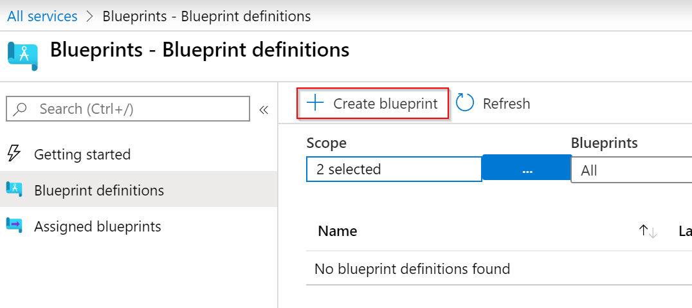

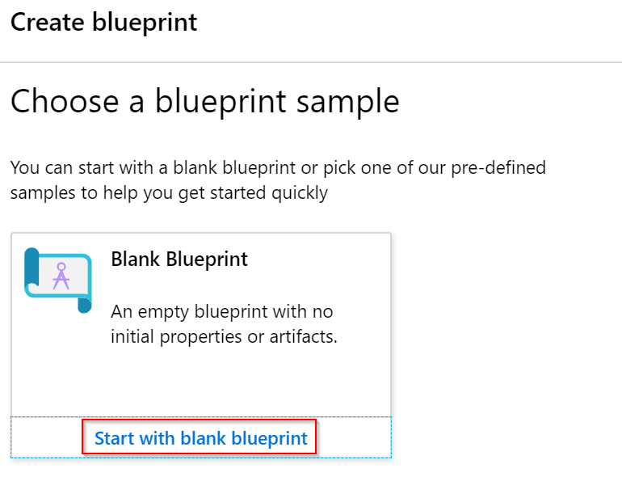

Define Blueprint name and choose its location.

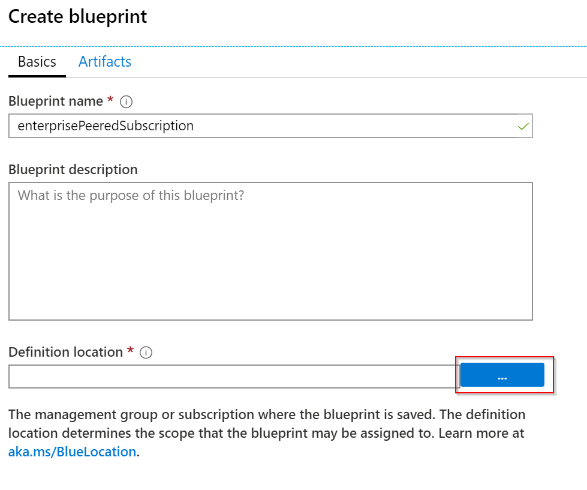

Make sure it is defined on Management Group level.

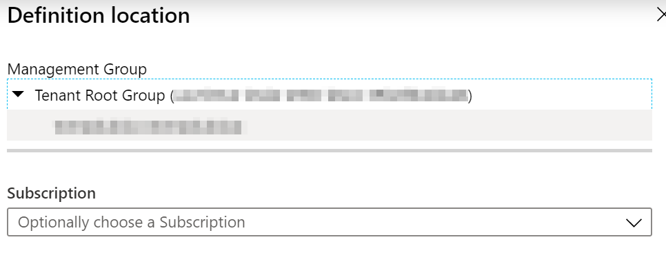

Start adding Artifacts.

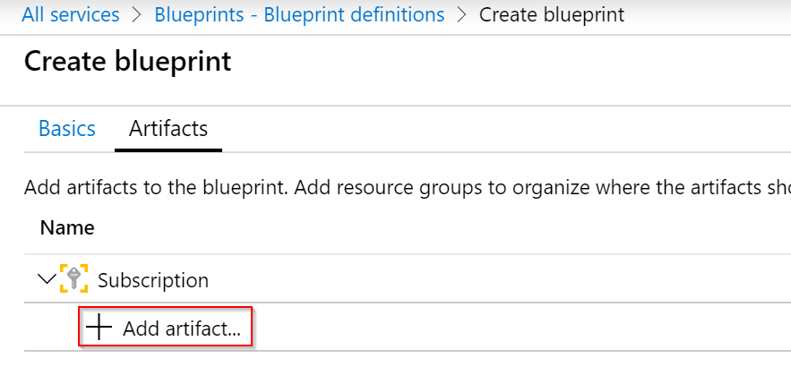

First we will add RBAC to subscription level. We want to assign project lead as Owner so he can add other members of his team or Service Principal accounts. As each subscription will have different project lead, we will make this parameter to be decided during Blueprint assignment.

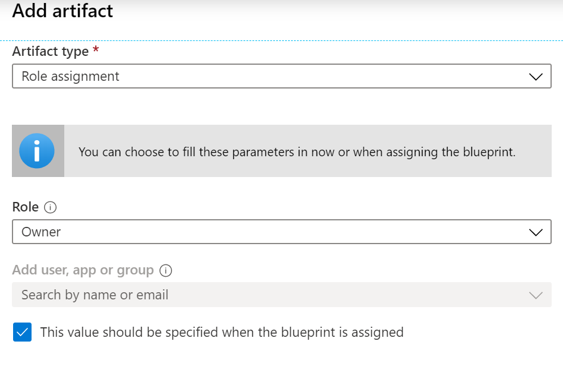

Next we will assign policies. For demonstration purposes we will do just one - restriction to locations.

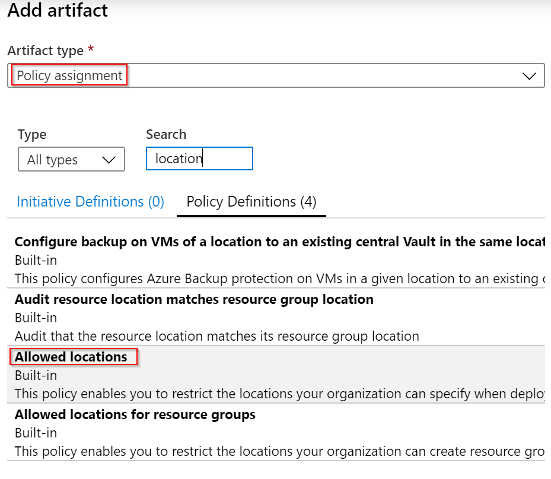

Then we are going to create resource group for networking components. For simplicity we want the same name in every subscription and always use West Europe, therefore we will set those in Blueprint definition directly rather than as parameter during assignment.

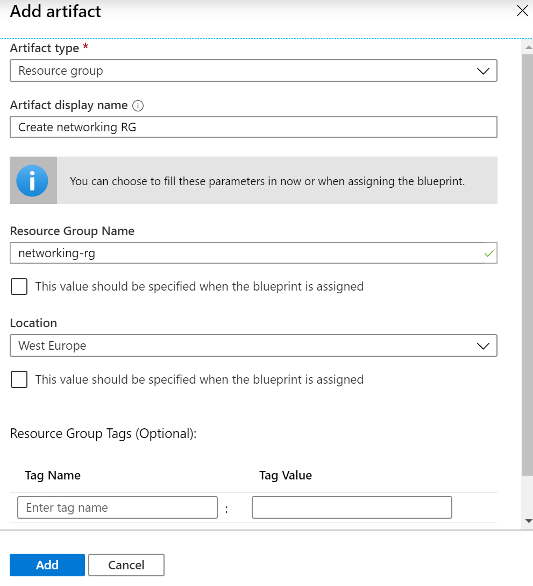

We now add artifacts into this resource group.

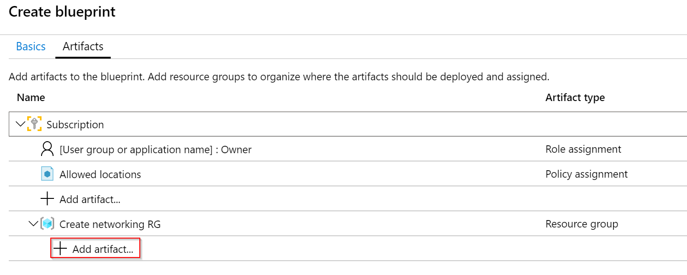

Note we plan to lock resources in this resource group so no one including subscription owner can modify those. We will add networkTeam (Security Group in AAD) as Network Contributor, but this is not giving them rights to modify resources because we plan to use lock (Deny Assignment). Note when assigning Blueprint via GUI you cannot specify exception for networking team, but later we will use PowerShell to achieve that.

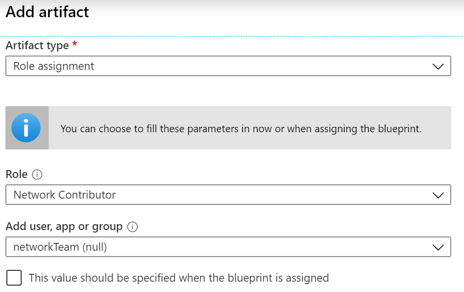

We will add additional artifact - ARM template to deploy spoke networking components and configure peering from spoke to hub and back. Note template is using nested deployment so we can configure peering from both sides. Since we need access to both spoke and hub subscription, we need to use user-managed identity for assignment (as we will see later). Copy contents of file hubNetworkWithPeering.json to GUI. Note there are parameters in ARM template and we will make them all decided during blueprint assignment phase.

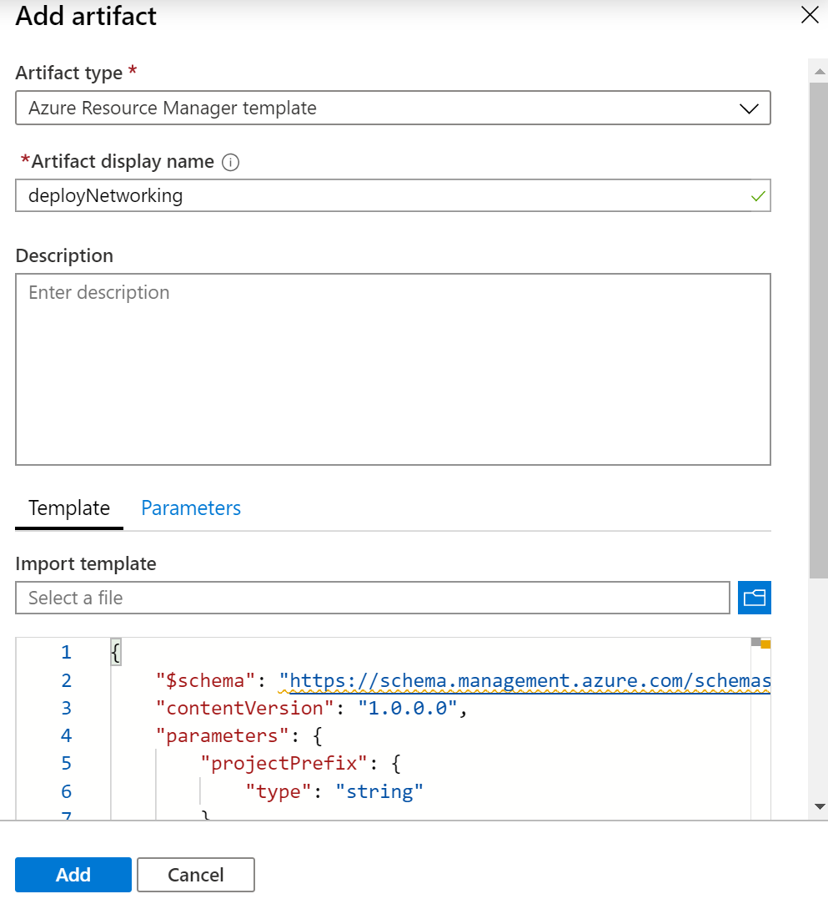

We now have Blueprint definition ready so let's save it.

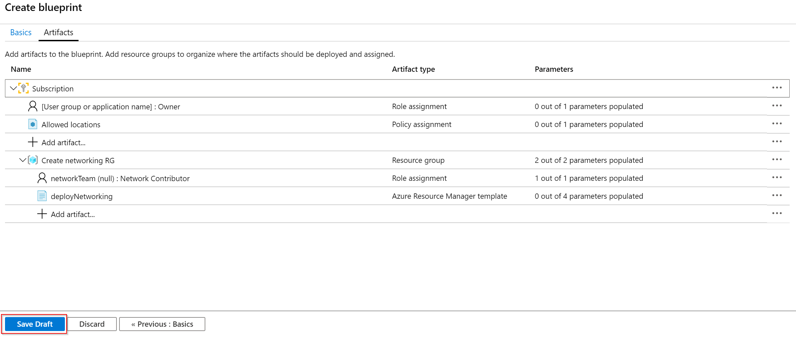

We will now publish our Blueprint.


Publish as v1.

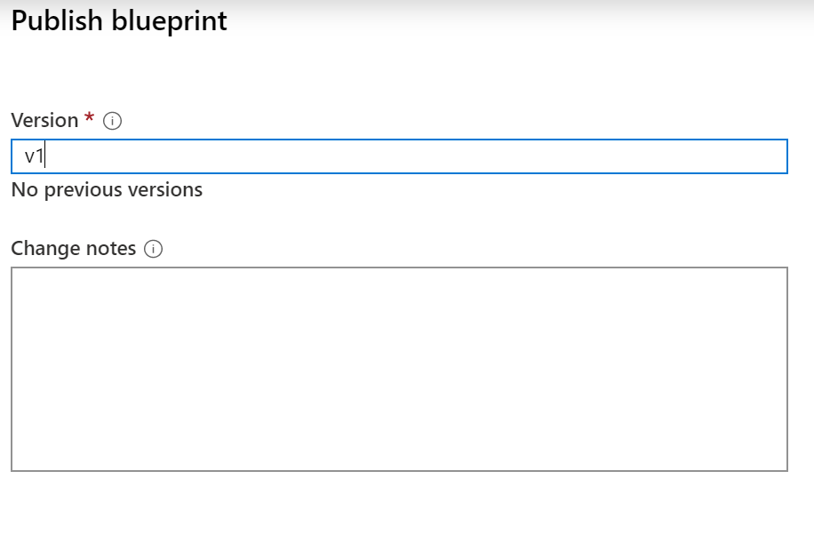

## Prepare user-managed identity
We will create user-managed identity in hub subscription and give it Network Contributor role to hub-networking-rg.

First make sure you have PowerShell Az module (tested with version 3.2.0) and Az.ManagedIdentity module installed.
```powershell
Install-Module -Name Az -AllowClobber -Scope CurrentUser
Install-Module -Name Az.ManagedServiceIdentity -AllowClobber -Scope CurrentUser
```

Create managed identity in hub-networking-rg and assign Network Contributor rights for this identity on scope of hub-networking-rg

```powershell
Set-AzContext -Subscription mojesub
New-AzUserAssignedIdentity -ResourceGroupName hub-networking-rg -Name blueprintRobot

New-AzRoleAssignment -ObjectId (Get-AzUserAssignedIdentity -Name blueprintRobot -ResourceGroupName hub-networking-rg).PrincipalId `
    -RoleDefinitionName "Network Contributor" `
    -ResourceGroupName "hub-networking-rg"
```

Store blueprintRobot GUID for later use.
```powershell
(Get-AzUserAssignedIdentity -Name blueprintRobot -ResourceGroupName hub-networking-rg).PrincipalId
```

## Assign and test behavior
As we need to use user-managed identity we first need to temporarily give blueprintRobot identity Owner role on spoke subscription. Make sure you use ObjectId of blueprintRobot identity gathered in previous step.

```powershell
Set-AzContext -Subscription mojesub2
New-AzRoleAssignment -ObjectId 61895eee-e28b-428f-9b66-0cf0e6f5ce45 -RoleDefinitionName "Owner"
```

Assign Blueprint.


Choose your spoke subscription.

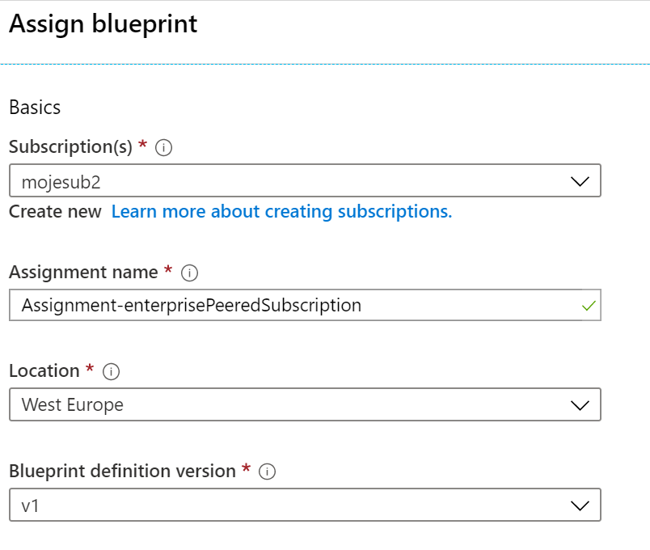

We want to lock all deployed resources and policies so no one even Owner of subscription can modify those. We will use user-assigned identity for deployment and lock.

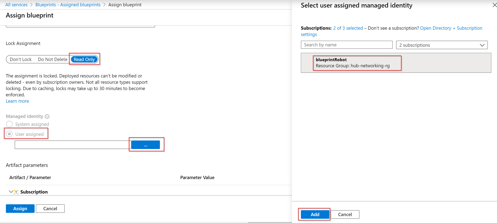

Let's assign parameters. We will insert project lead account who will be Owner of subscription and specify allowed regions (West Europe in our case).

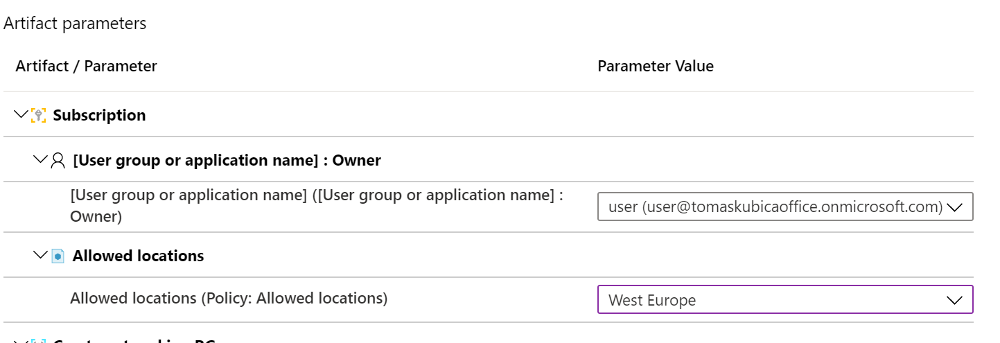

Specify project name prefix address ranges allocated to this spoke network. Then we are done so click Assign.

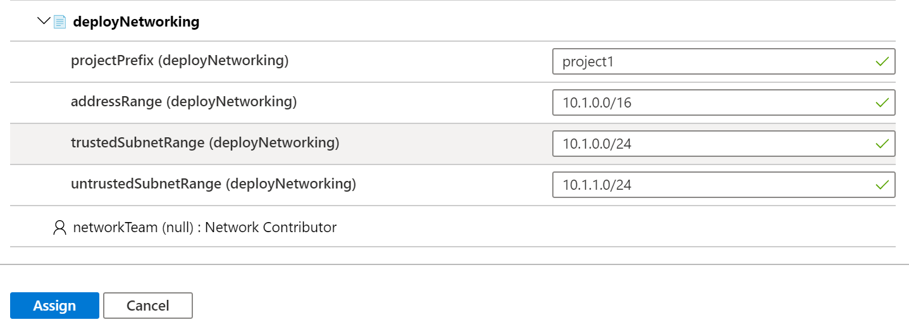

You can track progress of blueprint deployment.


Let's check what has been configured in spoke subscription. We will see resource group with networking created.

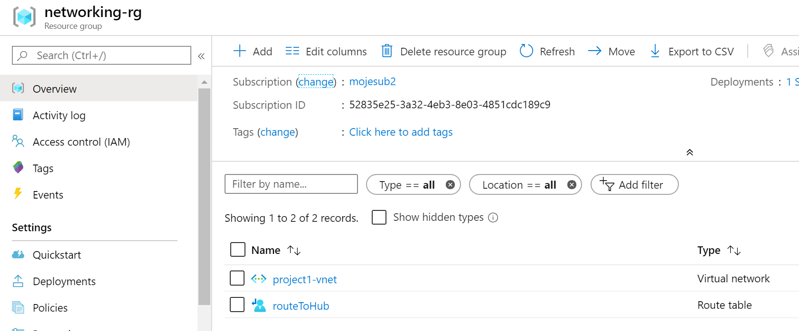

We can check VNET peering is configured and in connected state.


Note networkTeam has beed added to networking-rg, but since resources are locked, they by default cannot modify settings. Nevertheless they are able to check configurations and do troubleshooting. Should they need to modify settings there are two options:
- Undeploy Blueprint to remove lock so network team can do manual changes. After figuring things out you should make changes part of ARM template, modify Blueprint by publishing new version and assign this new version to subscription.
- You can assign network administrators as exception in Deny Statement so resources are not locked for them. Note this is currently not possible when assigning Blueprint via GUI, you need to use PowerShell (or API) as outlined later.

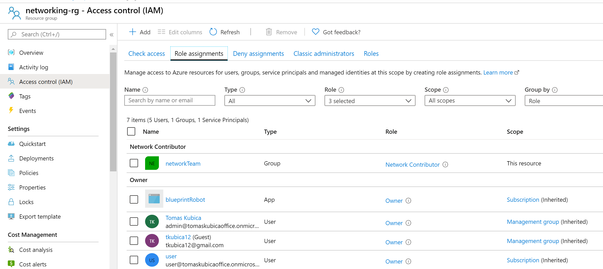

Let's have a look on Deny Assignments. 


Note resource is locked so nobody including Owner of subscription can modify resources in this resource group except for blueprintRobot. Later on we will remove blueprintRobot as subscription Owner so even this account cannot do any modifications. Later we will use PowerShell to assign Blueprint which allows for adding more identities to exceptions of Deny Assignment (lock) so we can let networking team modify settings after Blueprint assignment without need to unassign it.

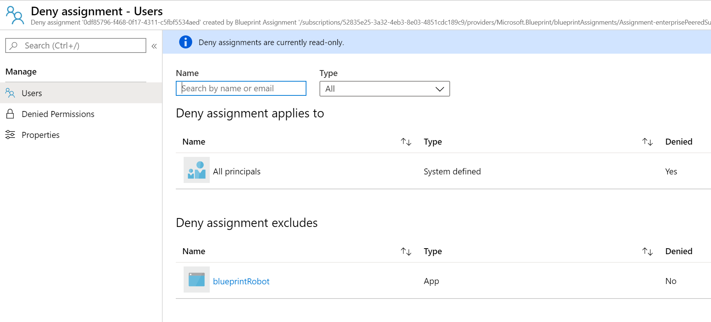

Azure Policy has also been assigned to our subscription.

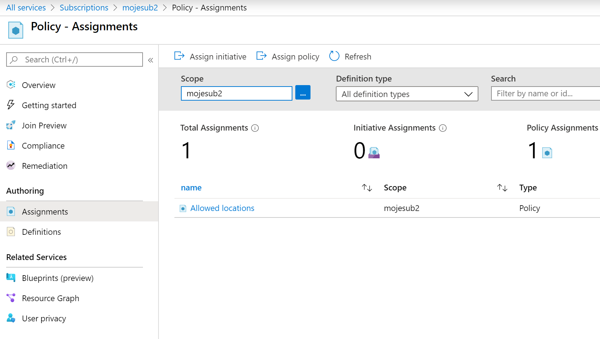

This is policy is also locked. Login as subscription Owner and try to disable this policy.

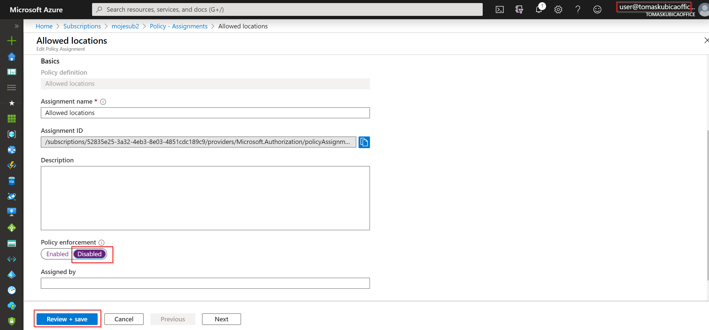

Note this operation failed because policy is locked by Blueprint.

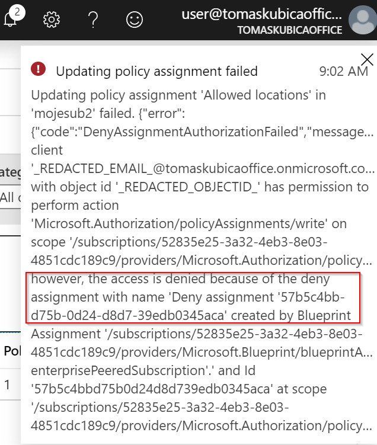

Now as blueprint has been assigned we can remove Owner role from blueprintRobot as it is no longer needed and according to least privilege strategy we should remove this assignment.

```powershell
Set-AzContext -Subscription mojesub2
Remove-AzRoleAssignment -ObjectId 61895eee-e28b-428f-9b66-0cf0e6f5ce45 -RoleDefinitionName "Owner"
```

When adding other subscriptions follow the same procedure:
1. Make blueprintRobot Owner
2. Assign Blueprint
3. Remove blueprintRobot Owner role

Note identity blueprintRobot will be kept for all subsequent operations/subscriptions, but will be Owner of subscription just during blueprint assignment.

## Automating assignment with PowerShell and setting exceptions on locked resources
So far we needed to modify RBAC, use GUI to deploy Blueprint and then modify RBAC again. We can automate this procedure using PowerShell. In order to test this, remove previous blueprint assignment on subscription.

First make sure Az.Blueprint PowerShell module is installed.

```powershell
Install-Module -Name Az.Blueprint
```

Next modify file blueprint-project1.json with the following:
- put ID of your user-managed identity (blueprintRobot in our case)
- blueprint ID
- specify Principal ID of project lead
- put networkTeam security group object ID to exceptions

You can gather those using PowerShell.

```powershell
# blueprintRobot ID
(Get-AzUserAssignedIdentity -Name blueprintRobot -ResourceGroupName hub-networking-rg).Id

# Blueprint ID
(Get-AzBlueprint -ManagementGroupId tomaskubica -Name enterprisePeeredSubscription -Version v1).Id
```

Now let's deploy Blueprint.

```powershell
# Assign blueprintRobot as Owner in spoke subscription
Set-AzContext -Subscription mojesub2
New-AzRoleAssignment -ObjectId 61895eee-e28b-428f-9b66-0cf0e6f5ce45 -RoleDefinitionName "Owner"

# Assign Blueprint
Set-AzContext -Subscription mojesub
New-AzBlueprintAssignment -Name 'project1-blueprint-assignment' `
    -SubscriptionId '52835e25-3a32-4eb3-8e03-4851cdc189c9' `
    -AssignmentFile '.\blueprint-project1.json'

# Remove blueprintRobot as Owner in spoke subscription
Set-AzContext -Subscription mojesub2
Remove-AzRoleAssignment -ObjectId 61895eee-e28b-428f-9b66-0cf0e6f5ce45 -RoleDefinitionName "Owner"
```

Note using this method you can create JSON file for each assignment and track it in version control system such as Azure DevOps or GitHub Enterprise. Using this method you can track changes and colaborate. As next step you may consider defining Blueprints themselves using JSON objects and use CI/CD pipelines to deploy new Blueprints and assignments to projects. Also note there are APIs (or PowerShell commands) available for creation of subscriptions also so whole process can be completely automated if needed.